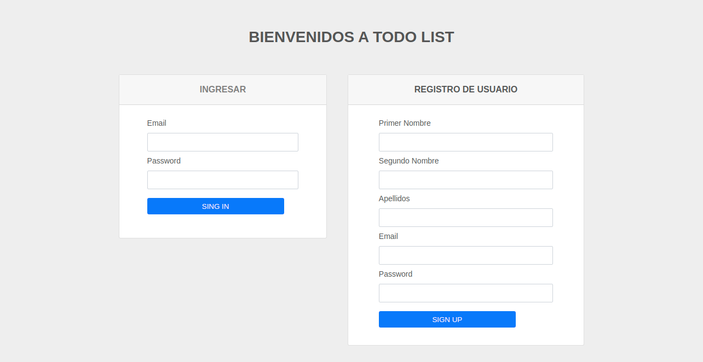
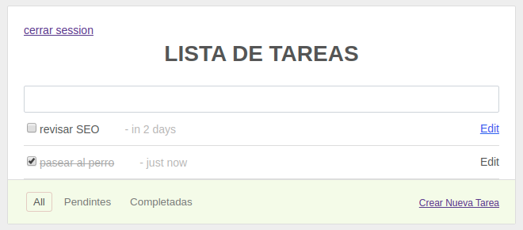

## Prueba Técnica -  Simple To-Do List

## Paso 1

Registrarse y iniciar session para poder continuar

## Paso 2

Registrar  actividades de `tareas` por usuarios 

## Especificaciones tecnicas

`Stack Utilizado: postgres, node (rest), react.`

`Frontend` realizado con react.js, styled-components, timeago.js (para convertir las fechas), react-router-dom y react-datepicker para calendario.

`Backend` realizado con node.js, express.js, pg (para conexion a la BD postgres), dotenv (para configurar el archivo .env), nodemon para  
el reinicio automatico al guardar algun cambio.

[backend](https://github.com/felix25/TO-DO-LIST/tree/master/backend)  
[frontend](https://github.com/felix25/TO-DO-LIST/tree/master/frontend)